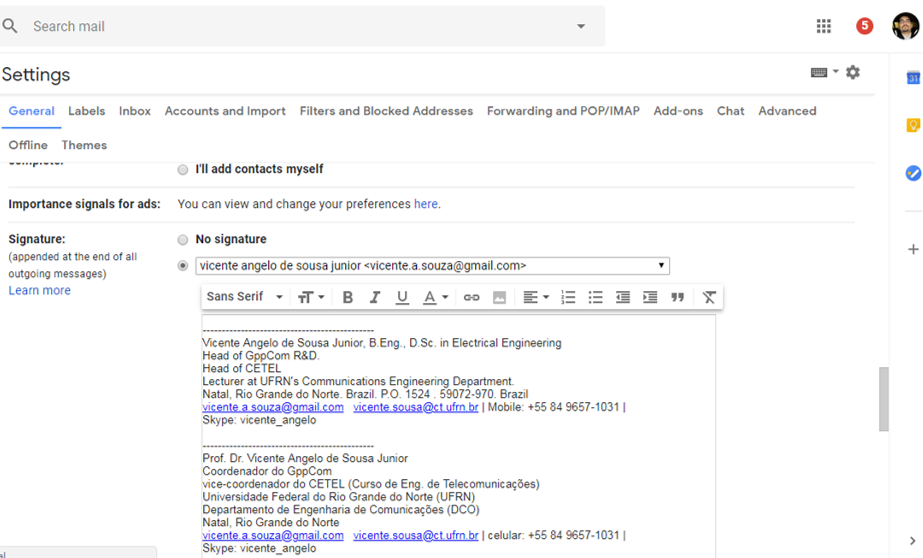

# Bolsistas de IC 2021
- Bolsista 01: RICARDO QUEIROZ DE FARIAS HENRIQUE SILVA
- Bolsista 02: DARIO GUILHERME DE MACEDO
- Orientador: Vicente Angelo de Sousa Junior
- Co-orientadores: Daniel Rodrigues de Luna e Tarciana Cabral de Brito Guerra 
- Companheiros de grupo: Lucas Ismael Campos Medeiros, Ravan Novaes de Oliveira e Sildolfo Francisco Gomes Neto 

### Metas 2021.1
- Preparação de ambiente de prototipagem
- Conhecer o ns-3 
- Avançar no conhecimento de redes de comunicações móveis (começar com o Wi-Fi)


### Recomendações gerais do GppCom

- No seu e-mail principal Criar uma assinatura do e-mail no padrão do GppCom, como no exemplo a seguir:

```
---------------------------------------------
Lucas Ismael Campos Medeiros
Graduando em Engenharia de Telecomunicações
Universidade Federal do Rio Grande do Norte (UFRN)
Natal, Rio Grande do Norte
Email: lucasismael.gppcom@ufrn.edu.br | lucasismaelcm@gmail.com
Tel: (84) 9 9669-2432
```

Fazer automaticamente no gmail de acordo com a figura a seguir:



- Comunicação corporativa
   - Mandar e-mail para lista quando o assunto for de interesse de todos: labsim-ufrn@googlegroups.com
   - Usar Whatsapp para notícias rápidas e compartilhamento de material técnico/oportunidades de cunho geral. E.g., avisar que mandou e-mail importante 
   - Grupos do Whatsapp
      - Grupo geral LabSim/GppCom: com todos os ex-bolsistas
      - Grupo vinculado a linha de pesquisa somente com o prof. Vicente e os participantes do grupo
   - **Evitar se comunicar (whatsapp, e-mail) somente com o prof. Vicente ou com um membro da equipe (TODOS DA EQUIPE ESPECIFICA PRECISAM SER COPIADOS EM TODAS AS MENSAGENS. Até as mensagens bobas!!!!)** 

- Criar conta do github com seu e-mail ```ufrn.edu.br```;
- Direcionar (forward) os e-mails da sua conta ```ufrn.edu.br``` para o seu e-mail principal do Gmail, caso já não seja o ```ufrn.edu.br```.

# Roteiro de atividades

As atividades dos bolsistas serão divididas em três frentes:
- **Frente 1:**  Preparação de ambiente de prototipagem
- **Frente 2:** prototipagem com ns-3
- **Frente 3:** Redes de Comunicações Móveis

As Seções a seguir são usadas para a definição e acompanhamento das atividades, utilizando a seguinte legenda:

- **TODO**: são tarefas específicas com escopo, dono e prazo;
- **Hands-on**: são materias já construídos no GppCom que servirão de referência de estudo; os hands-on tem texto, código e desafios de programação. Como de costume, a construção de novos Hands-on serão atribuídos para novos bolsistas a medida que forem avançando no treinamento;
- **P1, P2, P3 e P4**: níveis de prioridade para guiar a sequência de tarefas do bolsista. O nível **P1** é o de maior prioridade e deve ser feito primeiro. Somente tarefas com 
- **TBD (to be defined)**: tarefas ainda não agendadas, com escopo e/ou data a serem definidas;

### Frente 1: Preparação de ambiente de prototipagem:**
- Se habituar Linux, com Github, com jupyter notebook, com ns-3 e com o Eclipse 
- **TODO 1.1 (P1)**: Criação de máquina virtual Linux: seguir o (https://github.com/vicentesousa/2021_IC_Training/blob/master/h00_VM_18.04.ipynb)
   - Ricardo:**Prazo:** 12/04/2021. **Feito:** 05/04/2021.
   - Dario: novo. **Prazo:** 12/04/2021. **Feito:** 13/04/2021. 
- **TODO 1.2 (P1)**: Fase 00: Preparação do ambiente de trabalho (https://github.com/vicentesousa/2021_IC_Training/blob/main/fase_00/HD_01/f00_hd01.ipynb)
   - Hands-on 01: Github - o básico sobre repositórios
      - Ricardo: **Prazo:** 12/04/2021. **Feito:** 08/04/2021. **Deadline dos Updates:** 23/04/2021;   
      - Dario: **Prazo:** 12/04/2021. **Feito:** 13/04/2021. **Deadline dos Updates:** 23/04/2021;   
- **TODO 1.3 (P1)**: Fase 00: Preparação do ambiente de trabalho (https://github.com/vicentesousa/2021_IC_Training/blob/main/fase_00/HD_02/f00_hd02.ipynb)
   - Hands-on 02: Básico do Jupyter Notebook
      - Ricardo: **Prazo:** 12/04/2021. **Feito:** 08/04/2021. **Deadline dos Updates:** 23/04/2021;  **Feito:** 20/04/2021.
      - Dario: **Prazo:** 12/04/2021. **Feito:** 14/04/2021. **Deadline dos Updates:** 23/04/2021;  
- **TODO 1.4 (P2)**: Hands-on 03: Instalando o ns-3 e integrando com o Eclipse (https://github.com/vicentesousa/2021_IC_Training/blob/main/fase_00/HD_03/f00_hd03.ipynb)
   - Ricardo: **Prazo:** 30/04/2021. **Feito:** 28/04/2021.  
   - Dario: **Prazo:** 30/04/2021. **Feito:** 28/04/2021.  
  
### Frente 2: prototipagem com ns-3:
- Conhecer o ns-3 (leitura do Tutorial)
- **Roteiro de leituras:**
   - **TODO 2.1 (P2):** Ler capítulos 1, 2, 4 e 5 do tutorial do ns-3 e trazer dúvidas para discutir em reunião;
      - **Material Principal:** an introduction into downloading, setting up, and using builtin models [Tutorial ns-3](https://www.nsnam.org/docs/release/3.33/tutorial/ns-3-tutorial.pdf)
      - **Material Complementar:**  documentation on individual protocol and device models that build on the ns-3 core [Model Library do ns-3](https://www.nsnam.org/docs/release/3.33/models/ns-3-model-library.pdf)
      - **Material Complementar:** an in-depth coverage of the architecture and core of ns-3 [Manual do ns-3](https://www.nsnam.org/docs/release/3.33/manual/ns-3-manual.pdf)
      - Todo esse material pode ser encontrado em [https://www.nsnam.org/releases/ns-3-33/documentation/](https://www.nsnam.org/releases/ns-3-33/documentation/)
         - Ricardo: **Prazo:** 23/04/2021. **Novo Prazo:** 30/04/2021. **Feito:** 29/04/2021.  
         - Dario: **Prazo:** 23/04/2021. **Novo Prazo:** 30/04/2021. **Feito:** 30/04/2021.
   - **TODO 2.2 (P3):** Fazer e entender o exemplo first.cc (acompanhar a leitura no [Tutorial ns-3](https://www.nsnam.org/docs/release/3.33/tutorial/ns-3-tutorial.pdf)), ver as apresentações do minicurso de cada exemplo. O minicurso está na pasta ```<GoogleDrive>/GppCom_Entrance_Training\technical_material\ns-3_course>```.
      - Ricardo: **Prazo:** 30/04/2021. **Feito:** 29/04/2021.  
      - Dario: **Prazo:** 30/04/2021. **Feito:** 30/04/2021.
   - **TODO 2.3 (P3):** Hands-on 01: Desafios relacionados ao exemplo first.cc [link](https://github.com/vicentesousa/ns3-intermediate-training)
      - Ricardo: **Prazo:** 21/05/2021. **Feito:** 29/04/2021.  
      - Dario: **Prazo:** 21/05/2021. **Feito:** 30/04/2021. 
   - **TODO 2.4 (P3):** Ler capítulos 6 do tutorial do ns-3 e trazer dúvidas para discutir em reunião;
      - **Material Principal:** an introduction into downloading, setting up, and using builtin models [Tutorial ns-3](https://www.nsnam.org/docs/release/3.33/tutorial/ns-3-tutorial.pdf)
      - **Material Complementar:**  documentation on individual protocol and device models that build on the ns-3 core [Model Library do ns-3](https://www.nsnam.org/docs/release/3.33/models/ns-3-model-library.pdf)
      - **Material Complementar:** an in-depth coverage of the architecture and core of ns-3 [Manual do ns-3](https://www.nsnam.org/docs/release/3.33/manual/ns-3-manual.pdf)
      - Todo esse material pode ser encontrado em [https://www.nsnam.org/releases/ns-3-33/documentation/](https://www.nsnam.org/releases/ns-3-33/documentation/)
      - Ricardo: **Prazo:** 11/06/2021. **Feito:** 10/06/2021.   
      - Dario: **Prazo:** 11/06/2021. **Feito:** 09/06/2021.  
   - **TODO 2.5 (P3):** Fazer e entender o exemplo second.cc (acompanhar a leitura no [Tutorial ns-3](https://www.nsnam.org/docs/release/3.33/tutorial/ns-3-tutorial.pdf)), ver as apresentações do minicurso de cada exemplo. O minicurso está na pasta ```<GoogleDrive>/GppCom_Entrance_Training\technical_material\books>```.
      - Ricardo: **Prazo:** 11/06/2021. **Feito:** 04/05/2021.   
      - Dario: **Prazo:** 11/06/2021. **Feito:** 06/06/2021.    
   -  **TODO 2.6 (P3):** Hands-on 02: Desafios relacionados ao exemplo second.cc [link](https://github.com/vicentesousa/ns3-intermediate-training)
      - Ricardo: **Prazo:** 11/06/2021. **Feito:** 04/05/2021.  
      - Dario: **Prazo:** 11/06/2021. **Feito:** 06/06/2021.        
   - **TODO 2.7 (P3):** Fazer e entender o exemplo third.cc (acompanhar a leitura no [Tutorial ns-3](https://www.nsnam.org/docs/release/3.33/tutorial/ns-3-tutorial.pdf)), ver as apresentações do minicurso de cada exemplo. O minicurso está na pasta ```<GoogleDrive>/GppCom_Entrance_Training\technical_material\books>```.
      - Ricardo: **Prazo:** 11/06/2021. **Feito:** 10/06/2021.  
      - Dario: **Prazo:** 11/06/2021. **Feito:** 10/06/2021.   
   -  **TODO 2.8 (P3):** Hands-on 03: Desafios relacionados ao exemplo third.cc [link](https://github.com/vicentesousa/ns3-intermediate-training)
      - Ricardo: **Prazo:** 11/06/2021. **Feito:** 10/06/2021.  
      - Dario: **Prazo:** 11/06/2021. **Feito:** 10/06/2021.   
   
   - **TODO 2.9 (P3):** Ler capítulo 7 do tutorial do ns-3 e trazer dúvidas para discutir em reunião;
      - **Material Principal:** an introduction into downloading, setting up, and using builtin models [Tutorial ns-3](https://www.nsnam.org/docs/release/3.33/tutorial/ns-3-tutorial.pdf)
      - **Material Complementar:**  documentation on individual protocol and device models that build on the ns-3 core [Model Library do ns-3](https://www.nsnam.org/docs/release/3.33/models/ns-3-model-library.pdf)
      - **Material Complementar:** an in-depth coverage of the architecture and core of ns-3 [Manual do ns-3](https://www.nsnam.org/docs/release/3.33/manual/ns-3-manual.pdf)
      - Todo esse material pode ser encontrado em [https://www.nsnam.org/releases/ns-3-33/documentation/](https://www.nsnam.org/releases/ns-3-33/documentation/)
      - Ricardo: **Prazo:** 02/07/2021. **Feito:**  01/07/2021.  
      - Dario: **Prazo:** 02/07/2021. **Feito:**  02/07/2021.
   -  **TODO 2.10:** Hands-on 04: Desafios relacionados ao exemplo third.cc parte2 e fourth.cc [link](https://github.com/vicentesousa/ns3-intermediate-training)
      - Ricardo: **Prazo:** 25/06/2021. **Feito:**  25/06/2021.   
      - Dario: **Prazo:** 25/06/2021. **Feito:** 25/06/2021.
   -  **TODO 2.11:** Hands-on 05: Desafios relacionados ao exemplo fifth.cc [link](https://github.com/vicentesousa/ns3-intermediate-training)
      - Ricardo: **Prazo:** 02/07/2021. **Feito:**  01/07/2021.  
      - Dario: **Prazo:** 02/07/2021. **Feito:**  02/07/2021.
   -  **TODO 2.12:** Hands-on 05: Desafios relacionados ao exemplo sixth.cc [link](https://github.com/vicentesousa/ns3-intermediate-training)
      - Ricardo: **Prazo:** 09/07/2021. **Feito:**   
      - Dario: **Prazo:** 09/07/2021. **Feito:** 
   - **TODO 2.13 (P3):** Ler capítulo 8 do tutorial do ns-3 e trazer dúvidas para discutir em reunião;
      - **Material Principal:** an introduction into downloading, setting up, and using builtin models [Tutorial ns-3](https://www.nsnam.org/docs/release/3.33/tutorial/ns-3-tutorial.pdf)
      - **Material Complementar:**  documentation on individual protocol and device models that build on the ns-3 core [Model Library do ns-3](https://www.nsnam.org/docs/release/3.33/models/ns-3-model-library.pdf)
      - **Material Complementar:** an in-depth coverage of the architecture and core of ns-3 [Manual do ns-3](https://www.nsnam.org/docs/release/3.33/manual/ns-3-manual.pdf)
      - Todo esse material pode ser encontrado em [https://www.nsnam.org/releases/ns-3-33/documentation/](https://www.nsnam.org/releases/ns-3-33/documentation/)
      - Ricardo: **Prazo:** 16/07/2021. **Feito:**   
      - Dario: **Prazo:** 16/07/2021. **Feito:11/07/2021** 
   -  **TODO 2.14:** Hands-on 04: Desafios relacionados ao exemplo seventh.cc [link](https://github.com/vicentesousa/ns3-intermediate-training)
   
   
### Frente 3: Redes de Comunicações Móveis:
- Conhecendo o Wi-Fi
- **Roteiro de leituras:**
   - **TODO 3.1 (P2):** Ler Seção 14.1: IEEE 802.11 Architecture and Services do Livro **Wireless Communications Networking** (Stallings) (<GDrive>\GppCom_Entrance_Training\technical_material\books)
      - Ricardo: **Prazo:** 30/04/2021. **Feito:** 28/04/2021.  
      - Dario: **Prazo:** 30/04/2021. **Feito:** 29/04/2021.

   - **TODO 3.2 (P3):** Ler Seção 14.2: IEEE 802.11 Medium Access Control do Livro **Wireless Communications Networking** (Stallings) (<GDrive>\GppCom_Entrance_Training\technical_material\books)
      - Ricardo: **Prazo:** 21/05/2021. **Feito:19/05/2021**   
      - Dario: **Prazo:** 21/05/2021. **Feito:18/05/2021** 

   - **TODO 3.4 (P4):** Ler Seção 2.4 MAC Layer da tese **thesis-bingmann-ns-3-wifi** (<GDrive>\GppCom_Entrance_Training\technical_material)
      - Ricardo: **Prazo:** 21/05/2021. **Feito:19/05/2021**   
      - Dario: **Prazo:** 21/05/2021. **Feito:20/05/2021** 

   - **TODO 3.3 (P3):** Ler Seção 14.3: IEEE 802.11 Physical Layer do Livro **Wireless Communications Networking** (Stallings) (<GDrive>\GppCom_Entrance_Training\technical_material\books)
      - Ricardo: **Prazo:** TBD. **Feito:** ????.  
      - Dario: **Prazo:** TBD. **Feito:** ????.
   

      


